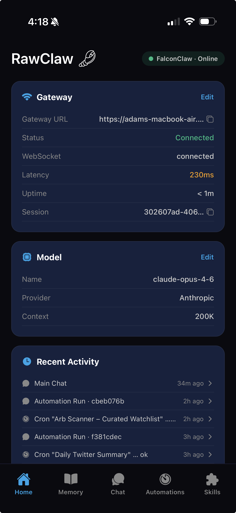
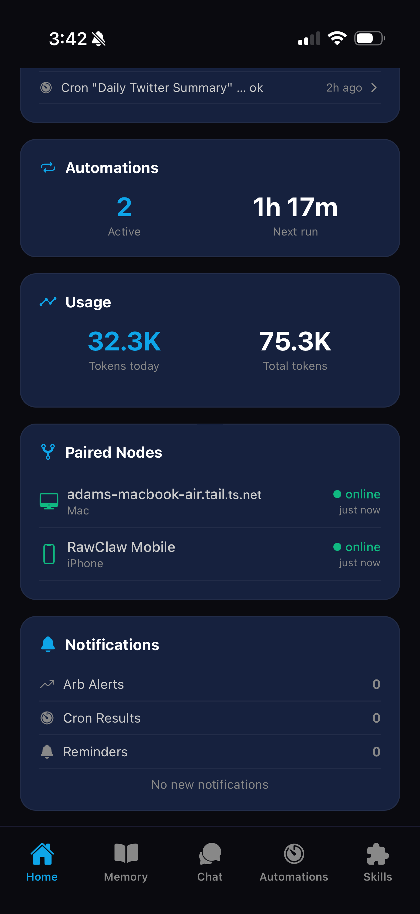
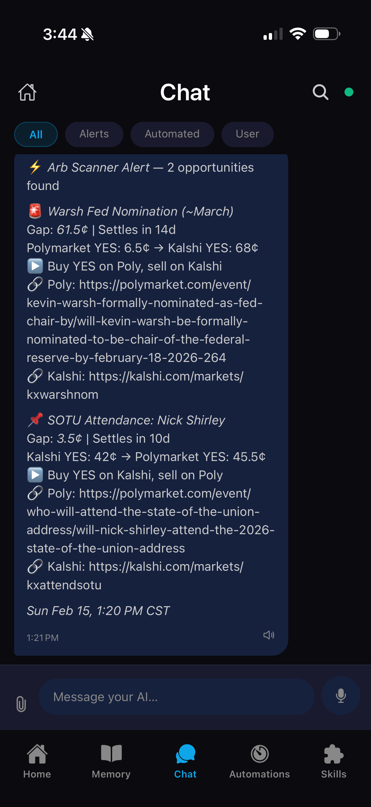
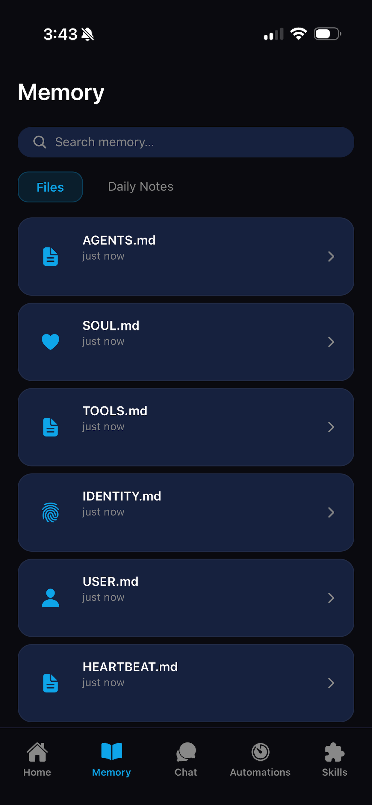
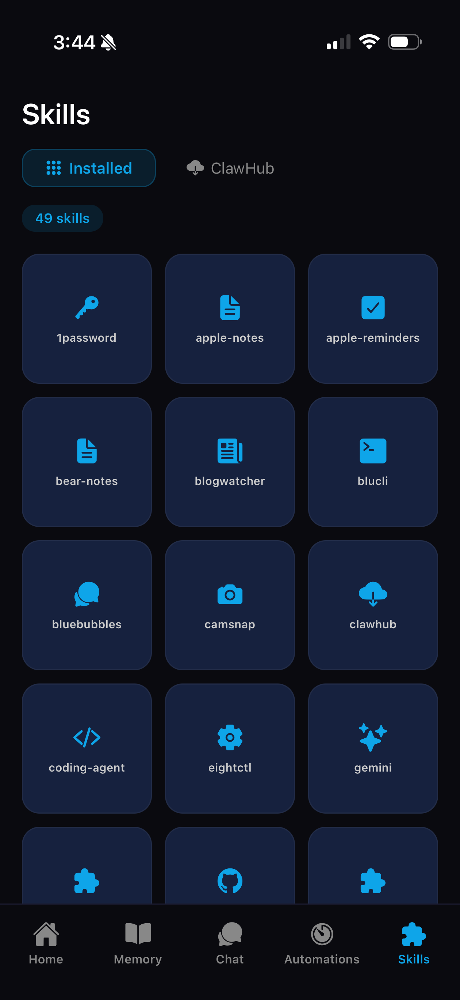

# RawClaw 🐾

> The mobile command center for your personal AI agent. Built for [OpenClaw](https://github.com/nichochar/openclaw).

**RawClaw is not just a chat app — it's a full operational dashboard for managing, monitoring, and interacting with your AI from anywhere.**

<!-- TODO: Add App Store badge once published -->
<!-- [](https://apps.apple.com/app/rawclaw/id0000000000) -->

🚧 **App Store release coming soon.** Until then, see [Development Setup](#development-setup) to run from source.

---

## What is RawClaw?

[OpenClaw](https://github.com/nichochar/openclaw) is an open-source personal AI agent framework that runs on your Mac (or server). **RawClaw** is the companion mobile app that gives you a complete interface to your agent — from your phone, from anywhere.

With RawClaw you can:

- **Chat** with your AI in real time with full markdown, tool-call transparency, voice, and file attachments
- **Monitor** gateway health, token usage, model info, and connected channels at a glance
- **Manage automations** — view, create, toggle, and run cron jobs on demand
- **Browse your AI's memory** — read and edit SOUL.md, MEMORY.md, USER.md, and other context files
- **Discover skills** — see installed capabilities and browse the ClawHub skill registry
- **Get notified** — category-based push notifications with deep-linking and quiet hours

---

## Screenshots

<p align="center">
  
  
  
</p>
<p align="center">
  <em>Home Dashboard (top) · Home Dashboard (bottom) · Chat</em>
</p>

<p align="center">
  
  
  
</p>
<p align="center">
  <em>Memory Browser · Automations · Skills</em>
</p>

---

## Getting Started

### Prerequisites

1. **An OpenClaw gateway** running on your Mac or server  
   → Follow the [OpenClaw setup guide](https://github.com/nichochar/openclaw) to get your agent running.

2. **Tailscale** (recommended for remote access)  
   → If you want to connect to your AI from outside your home network, Tailscale provides a secure, zero-config tunnel. See [Connecting to Your Gateway](#connecting-to-your-gateway) below.

### Install the App

<!-- TODO: Replace with real App Store link -->
> **App Store release coming soon.** You'll be able to download RawClaw directly from the iOS App Store.
>
> In the meantime, you can build from source — see [Development Setup](#development-setup).

### Connect to Your Gateway

Once you have the app installed and your OpenClaw gateway running:

1. Open RawClaw → tap the **status pill** (top right on the Home screen), or go to **Settings**
2. Enter your **Gateway URL** — this is wherever your OpenClaw instance is running (e.g. `http://100.x.x.x:3000`)
3. Enter your **Gateway Token** (the auth token from your OpenClaw config)
4. Tap **Test** to verify the connection, then **Save**

That's it — the app will connect via WebSocket and start pulling live data.

---

## Connecting to Your Gateway

RawClaw connects **directly** to your OpenClaw gateway over WebSocket — there is no intermediary server. The gateway URL you configure must be reachable from your device.

### Option A: Local Network (Same Wi-Fi)

If your phone and the machine running OpenClaw are on the same Wi-Fi network, use your Mac's local IP:

```
http://192.168.x.x:3000
```

Find your Mac's local IP: **System Settings → Wi-Fi → Details → IP Address**

### Option B: Tailscale (Recommended for Remote Access)

[Tailscale](https://tailscale.com) creates a secure, encrypted mesh network between your devices — no port forwarding, no firewall rules, works from anywhere.

1. **Install Tailscale** on your Mac (where OpenClaw runs):
   ```bash
   brew install tailscale
   ```
   Or download from [tailscale.com/download](https://tailscale.com/download)

2. **Install Tailscale on your iPhone** from the [App Store](https://apps.apple.com/app/tailscale/id1470499037)

3. **Sign in** to the same Tailscale account on both devices

4. **Use your Mac's Tailscale IP** as the Gateway URL in RawClaw:
   ```
   http://100.x.x.x:3000
   ```
   You can find this IP in the Tailscale app, or use the **MagicDNS** hostname:
   ```
   http://your-mac-name:3000
   ```

Tailscale handles encryption and NAT traversal automatically. Your gateway is never exposed to the public internet.

### Option C: Port Forwarding (Not Recommended)

You *can* expose your gateway via router port forwarding, but this is **not recommended** — it exposes your AI agent to the public internet. If you go this route, use HTTPS with a reverse proxy.

---

## Features

### 🏠 Home Dashboard
- Real-time gateway status with live latency measurement
- Activity feed aggregated from chat sessions, cron runs, and channel events
- Active automations count with next-run countdown
- Token usage with 7-day trend chart and cost estimates
- Paired nodes list showing all connected devices
- Notification summary by category
- Inline gateway connection editor
- Model info with in-app model picker

### 💬 Chat
- Real-time messaging via WebSocket (JSON-RPC protocol)
- Full markdown rendering — tables, code blocks with syntax highlighting, lists, links
- Collapsible tool-call cards showing what the AI executed, with inputs and outputs
- Multi-session tabs — create, switch, rename, and delete conversations
- Message category filters (All / Alerts / Automated / User)
- Slash command palette — type `/` to trigger quick actions
- Full-text search across conversation history
- File attachments with inline preview (images, documents)
- Voice input (speech-to-text) and text-to-speech output
- Copy any message to clipboard

### 🧠 Memory Browser
- Browse and edit AI memory files (`SOUL.md`, `MEMORY.md`, `USER.md`, `IDENTITY.md`, etc.)
- Inline markdown editor with live preview toggle
- Daily notes calendar view
- Diff viewer for file change history
- Semantic search across memory files

### ⚡ Automations
- View all cron jobs with human-readable schedules, status badges, and next-run times
- Enable/disable toggle per automation
- "Run Now" button for on-demand execution
- Run history with logs, output, duration, and error details
- Guided creation flow with visual cron schedule builder
- Edit and delete existing automations

### 🧩 Skills
- Browse installed skills in a visual grid with smart icons
- Per-skill documentation (reads SKILL.md files directly)
- Enable/disable individual skills
- **ClawHub integration** — discover and install skills from the community registry
- Search and category filtering

### 📊 Status
- Connection health with real-time latency measurement and uptime tracking
- Model info (name, provider, context window) with model picker
- Token usage and estimated cost with trend charts
- Paired nodes — all connected devices and services with last-seen timestamps
- Channel status (WhatsApp, Discord, iMessage, etc.) with health indicators

### ⚙️ Settings
- Gateway URL and token configuration (stored securely via `expo-secure-store`)
- Model override — browse available models and switch on the fly
- Theme switching — Light / Dark / System
- Notification routing per category (push, sound, badge toggles)
- Quiet hours with time picker (critical alerts still break through)
- App and gateway version info

### 🔔 Notifications
- Category-based push notifications (arb alerts, cron results, reminders, system)
- Per-category routing — control push, sound, and badge independently
- Quiet hours — suppress non-critical notifications overnight
- Deep-linking — tap a notification to jump directly to the relevant screen
- Android notification channels for OS-level control

---

## Architecture

```
RawClaw/
├── app/                        # Expo Router file-based routes
│   ├── _layout.tsx             # Root layout (providers + navigation stack)
│   ├── settings.tsx            # Settings modal
│   ├── (tabs)/                 # Tab navigator (6 tabs)
│   │   ├── index.tsx           # Home Dashboard
│   │   ├── chat.tsx            # Chat interface
│   │   ├── memory.tsx          # Memory Browser
│   │   ├── automations.tsx     # Automations list
│   │   ├── skills.tsx          # Skills grid + ClawHub
│   │   └── status.tsx          # System status
│   ├── automations/            # Automation detail + creation routes
│   ├── memory/                 # Memory file viewer/editor routes
│   └── skills/                 # Skill detail routes
├── src/
│   ├── components/             # 35+ reusable UI components
│   ├── hooks/                  # 16 custom React hooks for live data
│   ├── services/               # Gateway client, state store, cache, notifications
│   ├── theme/                  # Design system (colors, spacing, typography)
│   ├── types/                  # TypeScript interfaces
│   └── utils/                  # Helper functions
├── assets/                     # App icons and splash screen
└── docs/                       # Development roadmap and planning docs
```

### Gateway Communication

RawClaw communicates with OpenClaw via a **WebSocket connection** using a JSON-RPC protocol. The client handles authentication, auto-reconnection with exponential backoff, and streaming chat responses.

| RPC Method | Purpose |
|------------|---------|
| `connect` | Authenticate and establish session |
| `chat.send` / `chat.history` | Send messages and retrieve history |
| `sessions.list` / `sessions.delete` | Manage chat sessions |
| `cron.list` / `cron.run` / `cron.update` | Manage automations |
| `skills.status` | List installed skills |
| `channels.status` | Check channel health |
| `agents.files.list` / `agents.files.get` / `agents.files.set` | Read/write memory files |
| `status` / `health` | Gateway health and model info |
| `models.list` / `models.set` | Browse and set active model |
| `node.list` | List paired devices/nodes |

---

## Tech Stack

| Layer | Technology | Version |
|-------|-----------|---------|
| Framework | React Native (Expo) | SDK 54 |
| Routing | Expo Router (file-based) | 6.x |
| Language | TypeScript | 5.9 |
| Animations | react-native-reanimated | 4.1 |
| Markdown | @ronradtke/react-native-markdown-display | 8.x |
| Secure Storage | expo-secure-store | 15.x |
| Notifications | expo-notifications | 0.32.x |
| Voice I/O | expo-av + expo-speech | — |
| Calendar | react-native-calendars | 1.x |
| Diffs | diff | 8.x |
| Cron Parsing | cron-parser | 5.x |

Hand-crafted components throughout — no external UI component library.

---

## Development Setup

> For contributors or anyone who wants to run from source before the App Store release.

### Prerequisites

- **Node.js** >= 18
- **iOS**: Xcode 15+ and CocoaPods
- **Android**: Android Studio with SDK 34+

### Install and Run

```bash
# Clone the repo
git clone https://github.com/adamjweil/RawClaw.git
cd RawClaw

# Install dependencies
npm install

# Generate native projects
npx expo prebuild --clean

# Run on iOS simulator
npm run ios

# Run on Android emulator
npm run android

# Or start the Expo dev server and scan the QR code
npx expo start
```

### Project Scripts

| Script | Description |
|--------|-------------|
| `npm start` | Start Expo dev server |
| `npm run ios` | Build and run on iOS |
| `npm run android` | Build and run on Android |
| `npm run web` | Start Expo web |
| `npm run prebuild` | Regenerate native projects |
| `npm run build:ios` | EAS cloud build (iOS) |
| `npm run build:android` | EAS cloud build (Android) |

---

## Roadmap

See the [`docs/`](./docs/) folder for the full development roadmap:

- [**PRD**](./docs/PRD.md) — Product requirements document
- [**Progress & Plan**](./docs/PROGRESS_AND_PLAN.md) — Current status and phased implementation plan
- Deliverable specs for each development phase

---

## Contributing

Contributions are welcome! Please open an issue first to discuss what you'd like to change.

1. Fork the repository
2. Create a feature branch (`git checkout -b feature/my-feature`)
3. Commit your changes (`git commit -m 'Add my feature'`)
4. Push to the branch (`git push origin feature/my-feature`)
5. Open a Pull Request

---

## License

This project is licensed under the MIT License — see the [LICENSE](./LICENSE) file for details.
